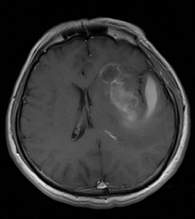
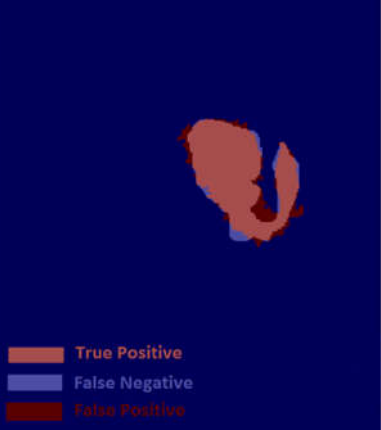
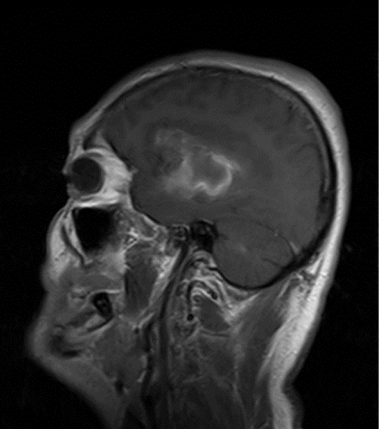
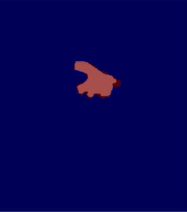
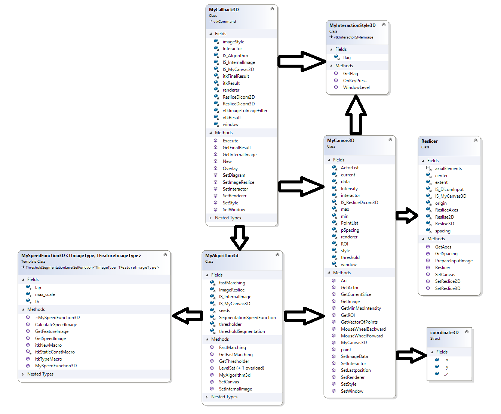

# Interactive_Segmentation

This project is my Master thesis which was completed in the Research Center for Biomedical Technology and Robotics (RCBTR) at Tehran University Of Medical Sciences (TUMS).

                                                      

At first, this project was defined for segment Glioma brain tumors in MRI T1+C Images, but it can be extended for another dicom images with small changes.

In this project a combined level set algorithm consists of both region and boundary terms for Glioma tumor segmentation is proposed. The modified speed function incorporates threshold based level set and the Laplacian filter to highlight the fine details for performing an accurate extraction of the tumor region using multiple seed points selected by the user.(See "sample" folder)

   

   

Red area is my result and white area is gold standard

## Installing

- download VTK-8.1 and ITK-4.13 and cmake-3.16.0
- config and Generate VTK by cmake(unchecked shared-libs and select openGL not openGl2) 
- open vtk.sln with visual studio(Run as administrator) and build Install with configuration Release 
- config and Generate ITK by cmake(unchecked shared-libs, check module_ITKVTKGlue and select vtk directory) 
- open itk.sln with visual studio(Run as administrator) and build Install with configuration Release 
- open Segmentaion3D or Segmentation2D and set libs and header files of vtk and itk

## Running the test

- set image directory in main function (MRI Images for Segmentation3D for example "input3D" file)
- set upper and lower threshold of area(s) that you want to segment
- run the project

## Usage

when project is running :
- if (key == "c") // contrast -> by draging mouse you can adjust contrast and brightness
- if (key == "b") // brush -> by clicking Left Button you can initialaze algorithm before running algorithm
- if (key == "r") // manual refine -> after ovelay MRI Image and Result Image you can add pixels as a final result 
- if (key == "p") // manual erase -> after ovelay MRI Image and Result Image you can erase pixels of the final result 
- if (key == "g") // go - run -> by clicking Left Button you can initialaze and run algorithm
- if (key == "o") // remove seed -> by clicking Left Button you can remove last seed and run algorithm

## UML

  

### Acknowledgment

Supervisor : Dr.Alireza Ahmadian

### Publication

https://ieeexplore.ieee.org/document/8301983/
